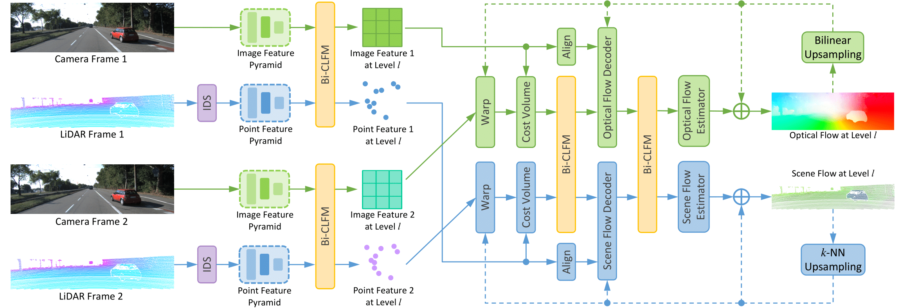

# CamLiFlow

This is the official PyTorch implementation for paper ["CamLiFlow: Bidirectional Camera-LiDAR Fusion for Joint Optical Flow and Scene Flow Estimation"](https://arxiv.org/abs/2111.10502). (CVPR 2022)



## News

* 2022-03-07: We release the code and the pretrained weights.
* 2022-03-03: Our paper is accepted by CVPR 2022.
* 2021-11-20: Our paper is available at [https://arxiv.org/abs/2111.10502](https://arxiv.org/abs/2111.10502)
* 2021-11-04: Our method ranked #1 on the leaderboard of [KITTI Scene Flow](http://www.cvlibs.net/datasets/kitti/eval_scene_flow.php).

## Pretrained Weights

| Training Set | Weights |
|--------------|---------|
| FlyingThings3D | [things.pt](https://drive.google.com/file/d/1gpERBftyqFoA0FPqGczfCXYfDW8B7VTN/view?usp=sharing) |
| FlyingThings3D -> Driving | [driving.pt](https://drive.google.com/file/d/1teNcu11xj_RUVI36DTvSKfCJzEYBWJmu/view?usp=sharing) |
| FlyingThings3D -> Driving -> KITTI | [kitti.pt](https://drive.google.com/file/d/1JfKLJ8mSYDS7rp1Zv6UMsQkHhZgeJqa5/view?usp=sharing) |

## Precomputed Results

Here, we provide precomputed results for the submission to the online benchmark of [KITTI Scene Flow](http://www.cvlibs.net/datasets/kitti/eval_scene_flow.php).

|  Rigidity  | D1-all | D2-all | Fl-all | SF-all | Link |
|------------|--------|--------|--------|--------|------|
|    None    | 1.81%  | 3.19%  | 4.05%  | 5.62%  | [camliflow-wo-refine.zip](https://drive.google.com/file/d/1zfH-uS9MxgZ8JZwUjNNHq7vASz1WD7SW/view?usp=sharing) |
| Background | 1.81%  | 2.95%  | 3.10%  | 4.43%  | [camliflow.zip](https://drive.google.com/file/d/1qi7zxSmEDcCA1ChwVHv6_eyNSXVxez7x/view?usp=sharing) |

## Environment

Create a PyTorch environment using `conda`:

```
conda create -n camliflow python=3.7
conda activate camliflow
conda install pytorch==1.10.2 torchvision==0.11.3 cudatoolkit=10.2 -c pytorch
```

Install other dependencies:

```
pip install opencv-python open3d tensorboard omegaconf
```

Compile CUDA extensions for faster training and evaluation (optional):

```
cd models/csrc
python setup.py build_ext --inplace
```

NG-RANSAC is also required if you want to evaluate on KITTI. Please follow [https://github.com/vislearn/ngransac](https://github.com/vislearn/ngransac) to install the library.

## Evaluation

### FlyingThings3D

First, download and preprocess the dataset (see `preprocess_flyingthings3d_subset.py` for detailed instructions):

```
python preprocess_flyingthings3d_subset.py --input_dir /mnt/data/flyingthings3d_subset
```

Then, download the pretrained weights [things.pt](https://drive.google.com/file/d/1gpERBftyqFoA0FPqGczfCXYfDW8B7VTN/view?usp=sharing) and save it to `checkpoints/things.pt`.

To reproduce the results in Table 1 (see the main paper):

```
python eval_things.py --weights checkpoints/things.pt
```

### KITTI

First, download the following parts:

* Main data: [data_scene_flow.zip](https://s3.eu-central-1.amazonaws.com/avg-kitti/data_scene_flow.zip)
* Calibration files: [data_scene_flow_calib.zip](https://s3.eu-central-1.amazonaws.com/avg-kitti/data_scene_flow_calib.zip)
* Disparity estimation (from GA-Net): [disp_ganet.zip](https://drive.google.com/file/d/1ieFpOVzqCzT8TXNk1zm2d9RLkrcaI78o/view?usp=sharing)
* Semantic segmentation (from DDR-Net): [semantic_ddr.zip](https://drive.google.com/file/d/1dVSJeE9BBmVv2rCe5TR0PVanEv2WzwIy/view?usp=sharing)

Unzip them and organize the directory as follows:

```
/mnt/data/kitti_scene_flow
├── testing
│   ├── calib_cam_to_cam
│   ├── calib_imu_to_velo
│   ├── calib_velo_to_cam
│   ├── disp_ganet
│   ├── flow_occ
│   ├── image_2
│   ├── image_3
│   ├── semantic_ddr
└── training
    ├── calib_cam_to_cam
    ├── calib_imu_to_velo
    ├── calib_velo_to_cam
    ├── disp_ganet
    ├── disp_occ_0
    ├── disp_occ_1
    ├── flow_occ
    ├── image_2
    ├── image_3
    ├── obj_map
    ├── semantic_ddr
```

Then, download the pretrained weights [kitti.pt](https://drive.google.com/file/d/1JfKLJ8mSYDS7rp1Zv6UMsQkHhZgeJqa5/view?usp=sharing) and save it to `checkpoints/kitti.pt`.

To reproduce the results **without** rigid background refinement (SF-all: 5.62%):

```
python kitti_submission.py --weights checkpoints/kitti.pt
```

To reproduce the results **with** rigid background refinement (SF-all: 4.43%):

```
python kitti_submission.py --weights checkpoints/kitti.pt --refine
```

You should get the same results as the precomputed ones.

## Training

### FlyingThings3D

> You need to preprocess the FlyingThings3D dataset before training (see `preprocess_flyingthings3d_subset.py` for detailed instructions).

First, pretrain the model on FlyingThings3D with the L2-norm loss:

```
python train.py --config conf/train/pretrain.yaml
```

Then, finetune the model on FlyingThings3D with the robust loss:

```
python train.py --config conf/train/things.yaml --weights outputs/pretrain/ckpts/best.pt
```

The entire training process takes about 10 days on 4 Tesla V100-SXM2-32GB GPUs. When the training is finished, the best weights should be saved to `outputs/things/ckpts/best.pt`.

### KITTI

> You need to preprocess the Driving dataset before training (see `preprocess_driving.py` for detailed instructions).

We adopt the training set schedule of `FlyingThings3D -> Driving -> KITTI`. Specifically, we first train our model on FlyingThings3D (see the above section for more details), then we finetune our model on Driving and KITTI sequentially.

First, finetune the model on Driving using the weights trained on FlyingThings3D:

```
python train.py --config conf/train/driving.yaml --weights outputs/things/ckpts/best.pt
```

Then, finetune the model on KITTI using the weights trained on Driving:

```
python train.py --config conf/train/kitti.yaml --weights outputs/driving/ckpts/best.pt
```

The entire training process takes about 0.5 days on 2 Tesla V100-SXM2-32GB GPUs. When the training is finished, the best weights should be saved to `outputs/kitti/ckpts/best.pt`.
