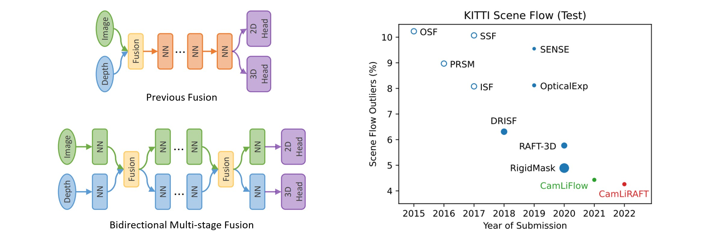

# CamLiFlow & CamLiRAFT

This is the official PyTorch implementation for our two papers: 

* Conference version: [CamLiFlow: Bidirectional Camera-LiDAR Fusion for Joint Optical Flow and Scene Flow Estimation](https://arxiv.org/abs/2111.10502). (CVPR 2022 Oral)

* Extended version (CamLiRAFT): [Learning Optical Flow and Scene Flow with Bidirectional Camera-LiDAR Fusion](https://arxiv.org/abs/2303.12017). (arXiv 2023)

中文解读：[https://zhuanlan.zhihu.com/p/616384758](https://zhuanlan.zhihu.com/p/616384758)



## Changes to the Conference Paper

In this extended version, we instantiate a new type of the bidirectional fusion pipeline, the **CamLiRAFT** based on the recurrent all-pairs field transforms. CamLiRAFT obtains significant performance improvements over the original PWC-based CamLiFlow and sets a new state-of-the-art record on various datasets.

* **Comparison with stereo scene flow methods**:  On FlyingThings3D, CamLiRAFT achieves 1.73 EPE2D and 0.049 EPE3D, 21\% and 20\% lower error compared to CamLiFlow. On KITTI, even the non-rigid CamLiRAFT performs on par with the previous state-of-the-art method RigidMask (SF-all: 4.97\% vs. 4.89\%). By refining the background scene flow with rigid priors, CamLiRAFT further achieves an error of 4.26\%, ranking **first** on the [leaderboard](http://www.cvlibs.net/datasets/kitti/eval_scene_flow.php).

* **Comparison with LiDAR-only scene flow methods**: The LiDAR-only variant of our method, dubbed CamLiRAFT-L, also outperforms all previous LiDAR-only scene flow methods in terms of both accuracy and speed (see Tab. 5 in the paper). Thus, CamLiRAFT-L can also serve as a strong baseline for LiDAR-only scene flow estimation.

* **Comparison on MPI Sintel**: Without finetuning on Sintel, CamLiRAFT achieves 2.38 AEPE on the final pass of the Sintel training set, reducing the error by 12% and 18% over RAFT and RAFT-3D respectively. This demonstrates that our method has good generalization performance and can handle non-rigid motion.

* **Training schedule**: The original CamLiFlow requires a complicated training schedule of Things (L2 loss) -> Things (Robust loss) -> Driving -> KITTI and takes about 10 days to train. CamLiRAFT simplifies the schedule to Things -> KITTI, and the training only takes about 3 days. (Tested on 4x RTX 3090 GPUs)

## News

* 2023-09-20: We provide a demo for CamLiRAFT, see `demo.py` for more details.
* 2023-03-22: We release CamLiRAFT, an extended version of CamLiFlow on [https://arxiv.org/abs/2303.12017](https://arxiv.org/abs/2303.12017).
* 2022-03-29: Our paper is selected for an **oral** presentation. 
* 2022-03-07: We release the code and the pretrained weights.
* 2022-03-03: Our paper is accepted by **CVPR 2022**.
* 2021-11-20: Our paper is available at [https://arxiv.org/abs/2111.10502](https://arxiv.org/abs/2111.10502)
* 2021-11-04: Our method ranked **first** on the leaderboard of [KITTI Scene Flow](http://www.cvlibs.net/datasets/kitti/eval_scene_flow.php).

## Pretrained Weights

| Model | Training set | Weights | Comments |
|-------|--------------|---------|----------|
| CamLiRAFT | Things (80e) | [camliraft_things80e.pt](https://drive.google.com/file/d/1nTh4Mugy5XltjcJHa7Byld2KIQ1IXrbm/view?usp=sharing) | Best generalization performance |
| CamLiRAFT | Things (150e) | [camliraft_things150e.pt](https://drive.google.com/file/d/1BEuKy5WMbaABW5Wz-Gx879kcNJ2Zla2Z/view?usp=sharing) | Best performance on Things | 
| CamLiRAFT | Things (150e) -> KITTI (800e) | [camliraft_things150e_kitti800e.pt](https://drive.google.com/file/d/18rBJpy1Bero9dM6HfqKfdZqE4vpU84aD/view?usp=sharing) | Best performance on KITTI |

## Precomputed Results

Here, we provide precomputed results for the submission to the online benchmark of [KITTI Scene Flow](http://www.cvlibs.net/datasets/kitti/eval_scene_flow.php). \* denotes refining the background scene flow with rigid priors.

|  Model  | D1-all | D2-all | Fl-all | SF-all | Link |
|---------|--------|--------|--------|--------|------|
| CamLiFlow    | 1.81%  | 3.19%  | 4.05%  | 5.62%  | [camliflow-wo-refine.zip](https://drive.google.com/file/d/1zfH-uS9MxgZ8JZwUjNNHq7vASz1WD7SW/view?usp=sharing) |
| CamLiFlow \* | 1.81%  | 2.95%  | 3.10%  | 4.43%  | [camliflow.zip](https://drive.google.com/file/d/1qi7zxSmEDcCA1ChwVHv6_eyNSXVxez7x/view?usp=sharing) |
| CamLiRAFT    | 1.81%  | 3.02%  | 3.43%  | 4.97%  | [camliraft-wo-refine.zip](https://drive.google.com/file/d/1H3x_OBRsVteDb7i5gaaY7cDc9ZQxUnZy/view?usp=sharing) |
| CamLiRAFT \* | 1.81%  | 2.94%  | 2.96%  | 4.26%  | [camliraft.zip](https://drive.google.com/file/d/1mzL5vKIOg-boBgknaxssuaiGcqvUybrV/view?usp=sharing) |

## Environment

Create a PyTorch environment using `conda`:

```
conda create -n camliraft python=3.7
conda activate camliraft
conda install pytorch==1.10.2 torchvision==0.11.3 cudatoolkit=11.3 -c pytorch
```

Install mmcv and mmdet:

```
pip install openmim
mim install mmcv-full==1.4.0
mim install mmdet==2.14.0
```

Install other dependencies:

```
pip install opencv-python open3d tensorboard hydra-core==1.1.0
```

Compile CUDA extensions for faster training and evaluation:

```
cd models/csrc
python setup.py build_ext --inplace
```

Download the ResNet-50 pretrained on ImageNet-1k:

```
wget https://download.pytorch.org/models/resnet50-11ad3fa6.pth
mkdir pretrain
mv resnet50-11ad3fa6.pth pretrain/
```

NG-RANSAC is also required if you want to evaluate on KITTI. Please follow [https://github.com/vislearn/ngransac](https://github.com/vislearn/ngransac) to install the library.

## Demo

Then, run the following script to launch a demo of estimating optical flow and scene flow from a pair of images and point clouds:

```
python demo.py --model camliraft --weights /path/to/camliraft/checkpoint.pt
```

Note that CamLiRAFT is not very robust to objects at a greater distance, as the network has only been trained on data with a depth of less than 35m. If you are getting bad results on your own data, try scaling the depth of the point cloud to a range of 5 ~ 35m.

## Evaluation

### FlyingThings3D

First, download and preprocess the dataset (see `preprocess_flyingthings3d_subset.py` for detailed instructions):

```
python preprocess_flyingthings3d_subset.py --input_dir /mnt/data/flyingthings3d_subset
```

Then, download the pretrained weights [camliraft_things150e.pt](https://drive.google.com/file/d/1BEuKy5WMbaABW5Wz-Gx879kcNJ2Zla2Z/view?usp=sharing) and save it to `checkpoints/camliraft_things150e.pt`.

Now you can reproduce the results in Table 2 (see the extended paper):

```
python eval_things.py testset=flyingthings3d_subset model=camliraft ckpt.path=checkpoints/camliraft_things150e.pt
```

### KITTI

First, download the following parts:

* Main data: [data_scene_flow.zip](https://s3.eu-central-1.amazonaws.com/avg-kitti/data_scene_flow.zip)
* Calibration files: [data_scene_flow_calib.zip](https://s3.eu-central-1.amazonaws.com/avg-kitti/data_scene_flow_calib.zip)
* Disparity estimation (from GA-Net): [disp_ganet.zip](https://drive.google.com/file/d/1ieFpOVzqCzT8TXNk1zm2d9RLkrcaI78o/view?usp=sharing)
* Semantic segmentation (from DDR-Net): [semantic_ddr.zip](https://drive.google.com/file/d/1dVSJeE9BBmVv2rCe5TR0PVanEv2WzwIy/view?usp=sharing)

Unzip them and organize the directory as follows:

```
datasets/kitti_scene_flow
├── testing
│   ├── calib_cam_to_cam
│   ├── calib_imu_to_velo
│   ├── calib_velo_to_cam
│   ├── disp_ganet
│   ├── flow_occ
│   ├── image_2
│   ├── image_3
│   ├── semantic_ddr
└── training
    ├── calib_cam_to_cam
    ├── calib_imu_to_velo
    ├── calib_velo_to_cam
    ├── disp_ganet
    ├── disp_occ_0
    ├── disp_occ_1
    ├── flow_occ
    ├── image_2
    ├── image_3
    ├── obj_map
    ├── semantic_ddr
```

Then, download the pretrained weights [camliraft_things150e_kitti800e.pt](https://drive.google.com/file/d/18rBJpy1Bero9dM6HfqKfdZqE4vpU84aD/view?usp=sharing) and save it to `checkpoints/camliraft_things150e_kitti800e.pt`.

To reproduce the results **without** leveraging rigid-body assumptions (SF-all: 4.97%):

```
python kitti_submission.py testset=kitti model=camliraft ckpt.path=checkpoints/camliraft_things150e_kitti800e.pt
```

To reproduce the results **with** rigid background refinement (SF-all: 4.26%), you need to further refine the background scene flow:

```
python refine_background.py
```

Results are saved to `submission/testing`. The initial non-rigid estimations are indicated by the `_initial` suffix.

### Sintel

First, download the flow dataset from: http://sintel.is.tue.mpg.de and the depth dataset from https://sintel-depth.csail.mit.edu/landing

Unzip them and organize the directory as follows:

```
datasets/sintel
├── depth
│   ├── README_depth.txt
│   ├── sdk
│   └── training
└── flow
    ├── bundler
    ├── flow_code
    ├── README.txt
    ├── test
    └── training
```

Then, download the pretrained weights [camliraft_things80e.pt](https://drive.google.com/file/d/1nTh4Mugy5XltjcJHa7Byld2KIQ1IXrbm/view?usp=sharing) and save it to `checkpoints/camliraft_things80e.pt`.

Now you can reproduce the results in Table 4 (see the extended paper):

```
python eval_sintel.py testset=sintel model=camliraft ckpt.path=checkpoints/camliraft_things80e.pt
```

## Training

### FlyingThings3D

> You need to preprocess the FlyingThings3D dataset before training (see `preprocess_flyingthings3d_subset.py` for detailed instructions).

Train CamLiRAFT on FlyingThings3D (150 epochs):

```
python train.py trainset=flyingthings3d_subset valset=flyingthings3d_subset model=camliraft
```

The entire training process takes about 3 days on 4x RTX 3090 GPUs.

### KITTI

Finetune the model on KITTI using the weights trained on FlyingThings3D:

```
python train.py trainset=kitti valset=kitti model=camliraft ckpt.path=checkpoints/camliraft_things150e.pt
```

The entire training process takes about 0.5 days on 4x RTX 3090 GPUs. We use the last checkpoint (800th) to generate the submission.

## Citation

If you find them useful in your research, please cite:

```
@article{liu2023learning,
  title   = {Learning Optical Flow and Scene Flow with Bidirectional Camera-LiDAR Fusion},
  author  = {Haisong Liu and Tao Lu and Yihui Xu and Jia Liu and Limin Wang},
  journal = {arXiv preprint arXiv:2303.12017},
  year    = {2023}
}

@inproceedings{liu2022camliflow,
  title     = {Camliflow: bidirectional camera-lidar fusion for joint optical flow and scene flow estimation},
  author    = {Liu, Haisong and Lu, Tao and Xu, Yihui and Liu, Jia and Li, Wenjie and Chen, Lijun},
  booktitle = {Proceedings of the IEEE/CVF Conference on Computer Vision and Pattern Recognition},
  pages     = {5791--5801},
  year      = {2022}
}
```
